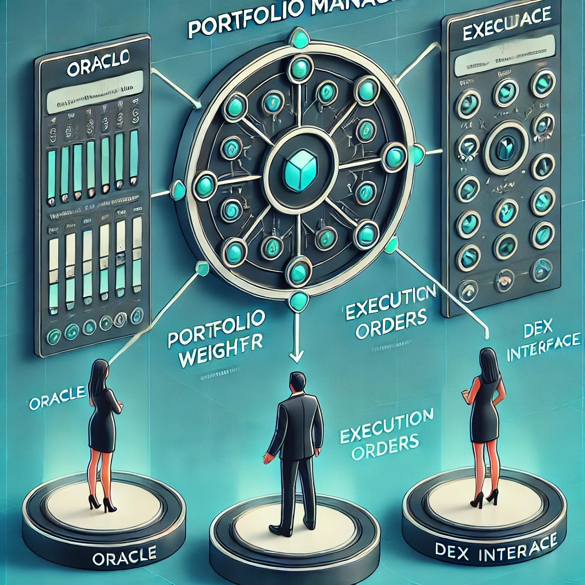

# DeFi Crypto Portfolio Management System

Welcome to the **DeFi Crypto Portfolio Management System** repository! This project provides a modular and extensible architecture for managing cryptocurrency portfolios using **Decentralized Finance (DeFi)** protocols. The system leverages **Oracle models**, a **Portfolio Manager**, and **DEX (Decentralized Exchange) interfaces** to automate and optimize portfolio rebalancing based on predictive analytics.


*System Design Overview*

---

# 🛠 System Overview

The system is built around three primary components:

1. **Oracle Interface**  
   Computes optimal portfolio weights based on real-time market data and predictive models (e.g., Numerai meta-model).  
   **Key Functions**:
   - Fetch portfolio weights (`fetch_portfolio_weights`)
   - Validate portfolio weights (`validate_weights`)

2. **Portfolio Manager**  
   Acts as the central coordinator, interfacing with the Oracle for weights and the DEX for execution.  
   **Key Function**:
   - Manage portfolio (`manage_portfolio`) by fetching and validating weights, then executing trades.

3. **DEX Interface**  
   Facilitates interaction with decentralized exchanges, including fetching tradable assets and setting portfolio weights.  
   **Key Functions**:
   - Retrieve the tradable asset universe (`get_universe`)
   - Execute portfolio rebalancing (`set_portfolio_weights`)

---

# 📚 Documentation

For detailed insights into the system’s design and functionality, refer to the following resources:

- [System Design Document](Defi_Crypto_Portofolio_System_v1.pdf): Detailed overview of the system's components, architecture, and data flow.
- [Example Code](Example%20Code.ipynb): Step-by-step guide to running a complete portfolio management workflow.

---

# 🚀 Quick Start

1. Clone the repository:
   ```bash
   git clone https://github.com/yourusername/defi-crypto-portfolio.git
   cd defi-crypto-portfolio
   ```

2. Install dependencies (if applicable):
   ```bash
   pip install -r requirements.txt
   ```
3. Configure the DEX system:
   Rename hyperliquid_config_template.json to hyperliquid_config.json and enter your API credentials for HyperLiquid.
   ```bash
   cp hyperliquid_config_template.json hyperliquid_config.json
   vim hyperliquid_config.json
   ```

5. Run the example notebook (in testnet!):
   Example Code.ipynb

# Code Example

```python
# Instantiate Oracle and DEX interfaces
oracle = NumeraiTBNOracle()
dex = HyperLiquidDEX("testnet")

print(dex.net_liq)
```
600.712248
```python
print( dex.positions )
```
{'BTC': 39.71432, 'ETH': 40.83264, 'BNB': 40.77696, 'INJ': 40.3606, 'TON': 39.34125, 'SUSHI': -41.77378, 'HBAR': -39.20392, 'XLM': -40.3209, 'SAND': -42.2886, 'IOTA': -38.87389}
```python
# Instantiate Portfolio Manager with Oracle
portfolio_manager = PortfolioManager(oracle, dex)

# Perform portfolio management
portfolio_manager.manage_portfolio()
```
...

# Backtester Overview

The backtester module was recently added to the project to evaluate the performance of trading strategies before deploying them live. This backtesting framework integrates seamlessly with the Oracle function used in the live trading system, ensuring that the results are consistent and realistic.

## Key Features

Data Retrieval: The backtester fetches historical data directly from HyperLiquid's S3 buckets. A local copy of the data is saved for future reference and to ensure reproducibility.

**Trading Assumption:** The backtesting process assumes that trades are executed at the instance just before 11 PM UTC each day, aligning with the Oracle's operational time.

**Portfolio Construction** The framework supports the generic oracle function, which allows seems transition from backtest to live trading.

**Performance Metrics** The backtester evaluates the return streams generated by the portfolio. Initial experiments show a positive but mixed return stream, with challenges in achieving a consistently positive performance after adjusting for risk metrics.

## Insights and Observations

The backtester demonstrates the utility of historical data in validating trading strategies.

The integration of risk metrics into the backtesting process provides valuable insights into strategy robustness and potential areas for improvement.

# Usage

To run the backtester: https://github.com/jefferythewind/defi_crypto_pm/blob/main/Back%20Tester.ipynb

1. Ensure access to HyperLiquid's S3 buckets and configure the data retrieval settings.

2. Define DEX and Oracles based on above info. Best to use Main net here for Hyperliquid DEX, since testnet has a different universe.

3. Execute the backtester script and review the generated performance metrics and logs.

Refer to the Backtester Notebook for detailed implementation and example usage. This notebook provides step-by-step instructions for setting up the backtester, running simulations, and analyzing results.

This module is a critical step toward refining trading strategies and enhancing the overall performance of the system.

## 📈 Future Enhancements
Implement concrete Oracle and DEX classes for integration with live data sources.
Extend the Portfolio Manager to include risk management and performance analytics.
Build additional DEX integrations to support more trading platforms.

## ⚠️ Disclaimer
This project is a conceptual implementation and is not intended as financial advice or a recommendation. The software is provided as-is and should be used at your own risk. The maintainers are not responsible for any outcomes resulting from the use of this software.

## 📝 Contributing
We welcome contributions! If you have suggestions, feature requests, or bug fixes, feel free to open an issue or submit a pull request.

## 🔗 License
This project is licensed under the MIT License.

## 🤝 Acknowledgments
Inspired by cutting-edge developments in DeFi and Numerai's meta-model.
Special thanks to contributors and collaborators for their invaluable input.


